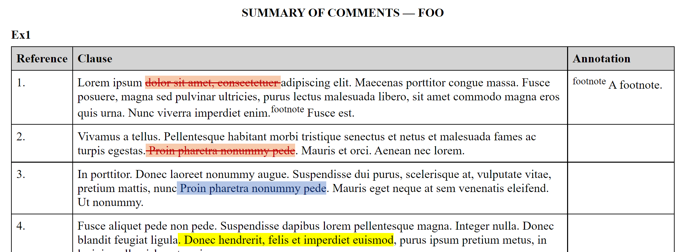

# claarity
Automatically create reports from docx files with tracked changes, comments, etc.

claarity uses [Docxplora](https://github.com/splittist/docxplora) to extract paragraphs with items of interest
from `docx` files (technically, files in Open Office XML Wordprocessing markup format)
and populate [djula](https://mmontone.github.io/djula/djula/) and [docxdjula](https://github.com/splittist/docxdjula) 
templates with those items.
When the item of interest is a paragraph with [tracked changes](https://support.microsoft.com/en-us/office/track-changes-in-word-197ba630-0f5f-4a8e-9a77-3712475e806a)
the changes are displayed with formatting supplied by [trackpalette](https://github.com/splittist/trackpalette).

## Usage

*function* **REPORT** &key *(format 'wml)* *infiles* *outfile* *arguments* *template*  *(revisionsp t)* *highlightingp* *square-brackets-p* *commentsp* *footnotesp* *endnotesp*

Extracts paragraphs with items of interest
from the files designated by *infiles* (a single path or a list of paths),
passing them, together with the addtional template
arguments in *arguments* (a list) to the template designated by *template*,
writing the result to *outfile*.

*format* defaults to `'wml`, but can also be `'html`. (This can be extended, see below.)

*template* defaults to `*default-docxdjula-template*` when `format` is `'wml`, and `*default-djula-template*` when `format` is `'html`.

*outfile* defaults to the result of APPLYing `*outfile-name-generator*` to *format* and the *infiles*. By default this creates a file with the pathname
of the first *infile* with "Report-" prepended to the name and the appropriate file type for the *format*.

If *revisionsp* is true (the default), paragraphs with tracked changes will be extracted, those tracked changes being styled by **trackpalette**.

If *highlightingp* is true, paragraphs with [highlighting](https://support.microsoft.com/en-us/office/apply-or-remove-highlighting-1747d808-6db7-4d49-86ac-1f0c3cc87e2e) will be extracted.

If *square-brackets-p* is true, paragraphs with `#\[` or `#\]` will be extracted.

If *commentsp* is true, paragraphs with comments will be extracted, as will the text and the author of the associated comment(s).

If *footnotesp* is true, paragraphs with footnotes will be extracted, as will the corresponding text of the footnote.

If *endnotesp* is true, paragraphs with endnotes will be extracted, as will the corresponding text of the endnote.

Note that the style of the extracted paragraphs will be simplified to improve the clarity of the report.

*special* **\*DEFAULT-DOCXDJULA-TEMPLATE\***

The **docxdjula** template to be used if one is not specified. Initially set to the path of a file named "MultifileCommentTemplate.docx" in the "templates" directory of the "claarity" asdf system directory.

*special* **\*DEFAULT-DJULA-TEMPLATE\***

The **djula** template to be used if one is not specified. Initially set to the path of a file named "MultifileCommentTemplate.html" in the "templates" directory of the "claarity" asdf system directory.

*special* **\*OUTFILE-NAME-GENERATOR\***

The function to be used to generate the name of the *outfile* if one is not specified. See above.

*special* **\*FORMAT\***

Dynamically bound to the *format* specified (or defaulted) in the call to REPORT.

*symbol* **WML**

Used to specify the *format* that results in a `docx` file (using **docxdjula**).

*symbol* **HTML**

Used to specify the *format* that results in an `html` file (using **djula**).

## Extending

**claarity** may well be extended to be able to output different types of report. There are two types of information extracted from a document:
*paragraphs* and *annotations*. *Paragraphs* are the paragraphs of the text of the document that contain within themselves items of interest (track changes,
highlighting, etc.). *Annotations* are the text etc. of the items of interest that appear alongside, below or at the end of text of the document (comments, footnotes and endnotes). Depending on the combination of items of interest chosen a particular piece of text might be both a *paragraph* and an *annotation*: a paragraph within the text of a footnote with tracked changes, for example.

*generic function* **PROCESS-PARAGRAPH-FOR-FORMAT** *format* *paragraph*

Called to adapt *paragraph* (a wml paragraph) for *format* (a symbol).

*generic function* **PROCESS-ANNOTATION-FOR-FORMAT** *format* *annotation*

Called to adapt *annotation* (which could be a number of paragrpahs: see above and, generally, the source) for *format* (a symbol).

## Templates

The template will be passed a list of template arguments consisting of the arguments passed in as *arguments* to the **REPORT** function and an entry `:FILES`, consiting of one plist for each of the *infiles* consisting of one entry (`:NAME`) for the `PATHNAME-NAME` of the `infile`, and one entry (`:ENTRIES`) containing a list of plists with `:REFERENCE`, `:PARAGRAPH` and `:ANNOTATION` entries, the values being a reference for the paragraph, the text of the paragraph, and the text of any comments, footnotes or endnotes if those items have been selected as being of interest.

The template can, therefore, iterate through the files in `files`, and for each file refer to its `file.name` and the `file.entries`, each entry containing an `entry.reference`, `entry.paragraph` and `entry.annotation`.

Note that `entry.paragraph` and `entry.revision` are in the *format*-appropriate, so need to be passed to the `safe` psuedo-filter.

An example might help. The following (part of a) **djula** template:

``` html
<body>
    <h1>SUMMARY OF COMMENTS &mdash; {{ project }}</h1>
    
    <div class="hscroll">
        <table>
            <caption>{{ file.name }}</caption>
            <thead>
                <tr>
                    <th>Reference</th>
                    <th>Clause</th>
                    <th>Annotation</th>
            </thead>
            <tbody>
                
                <tr>
                    <td>{{ entry.reference }}</td>
                    <td>{{ entry.paragraph | safe }}</td>
                    {{ entry.annotation | safe }}
                
                </tr>
            </tbody>
        </table>
    </div>
    
</body>
```
will result in the following (part of an) **html** report:

